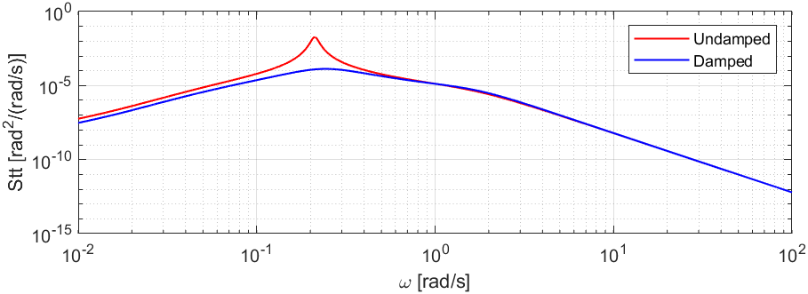

# Stochastic Aerospace System Analysis

In this project, I performed time and spectral analyses on the response of a simulated Cessna Citation I model under atmospheric turbulence.  This project focuses on the longitudinal symmetric states for simplicity, meaning lateral asymmetric states are not considered. 

## Problem Statement

The task is to investigate the differences in methods used to analyse stochastic systems. In particular, I looked at how power spectral densities are constructed (analytical vs. numerical) and variances calculated in an aircraft with and without a pitch damper. The aircraft model is supplemented with atmospheric turbulence modelled as follows:

- Driven by white noise with spectral density $S_{nn} = 1$

- Random, normally distributed process → fully characterised by covariance matrix

- Stationary → statistical properties do not change over time

- Homogeneous → statistical properties do not change along flight path

- Isotropic → statistical properties of the turbulence are independent of direction

## Results

For this project, the states tracked were:

- The airspeed deviation: $\frac{u}{V}$
- The angle of attack: $\alpha$ 
- The pitch angle: $\theta$
- The pitch rate: $\frac{q\bar{c}}{V}$
- Vertical load factor $n_z$

The variances for both damped and undamped configurations (Table 1 and 2 below) were calculated for each state using:

1. The analytical Power Spectral Density (PSD)
2. The Fast Fourier Transform (FFT)
3. The Welch smoothing routine
4. MATLAB's Var function

For the PSDs / periodograms and further details, see methodology.

##### Table 1: Undamped State Variances

| Method (Undamped) | $\frac{u}{V}$ [-] | $\alpha$ [rad²] | $\theta$ [rad²] | $\frac{q\bar{c}}{V}$ [-] | $n_z$ [-] |
| ----------------- | ----------------: | --------------: | --------------: | -----------------------: | --------: |
| Analytical        |          1.623E-4 |        1.357E-3 |        2.037E-4 |                 3.807E-8 |  2.073E-3 |
| FFT               |          8.022E-5 |        1.420E-3 |        1.215E-4 |                 3.453E-8 |  1.888E-3 |
| Pwelch            |          7.969E-5 |        1.354E-3 |        1.191E-4 |                 3.478E-8 |  1.853E-3 |
| Var.m             |          7.997E-5 |        1.309E-3 |        1.215E-4 |                 3.452E-8 |  1.887E-3 |

##### Table 2: Damped Variances

| Method (Damped) | $\frac{u}{V}$ [-] | $\alpha$ [rad²] | $\theta$ [rad²] | $\frac{q\bar{c}}{V}$ [-] | $n_z$ [-] |
| --------------- | ----------------: | --------------: | --------------: | -----------------------: | --------: |
| Analytical      |          1.838E-5 |        1.346E-3 |        1.759E-5 |                 2.569E-8 |  1.867E-3 |
| FFT             |          1.951E-5 |        1.417E-3 |        1.904E-5 |                 2.569E-8 |  1.978E-3 |
| Pwelch          |          1.937E-5 |        1.352E-3 |        1.847E-5 |                 2.569E-8 |  1.950E-3 |
| Var.m           |          1.941E-5 |        1.307E-3 |        1.904E-5 |                 2.663E-8 |  1.977E-3 |

### Key takeaways

1. Overall, the variances were all in line with each other
2. The pitch damper restricted how excitable the pitch is. Variances of speed deviation, pitch and pitch rate were all lower with a pitch damper
3. Differences between Analytical and FFT/Pwelch are attributed to integration errors. Riemann sums approximate integrals better for smooth curves with minimal fluctuations like the analytical PSDs

## Methodology

The PSDs / periodograms and a brief background for each method are given below. The running example uses the pitch angle $\theta$, but the methodology applies to all states.

### Analytical Power Spectral Density (PSD)

To construct the analytical PSDs, the state-space system needs to be known in order to extract the desired input-output transfer function. Once known, the PSD of a state $x$ can be calculated by:

$$ S_{xx}(\omega) = |H(\omega)|^2 S_{nn}(\omega) $$

Where $H(\omega)$ is the transfer function mapping a noise input $n$ to a state output $x$. Since the white noise had a unit spectral density, this simplifies to just:

$$ S_{xx}(\omega) = |H(\omega)|^2$$

MATLAB's bode function was used to get the magnitude. It takes as input the state representation and a 4000 length frequency axis vector with bounds $\omega \in [10^{-2},10^{2}]$.  The analytical one-sided PSD for $\theta$ is shown below.

	

### Fast Fourier Transform (FFT)

The FFT is an efficient implementation of the DFT, as such it maps the sequence of samples in the time-domain onto a discrete frequency dimensionless axis $\Omega \in [0,2\pi]$. This dimensionless discrete frequency axis can be translated to $\omega$ in [rad/s] using the number of samples $N$, the radial resolution $\frac{2\pi}{T}$, the sample frequency $f_s$ and the frequency resolution $\frac{f_s}{N}$. The FFT aims to estimate the continuous time PSD via a one-sided periodogram.

The one-sided periodogram calculated by the FFT for $\theta$ is shown below. The jitteriness towards the higher frequencies is caused by a phenomenon called leakage, which occurs when the signal frequencies are not an integer multiple of the frequency resolution. This results in off-centre sinc functions from signal frequencies at non-integer multiples of the frequency resolution "leaking" into the integer multiple frequency resolution bins.

	

### Welch Routine (Pwelch)

The Welch routine involves smoothing the state traces by first breaking the time series into $K$ segments with some segment overlap allowed and then multiplying the segments by a Hamming window (seen below) before performing an FFT.

	

In essence, the window function forces the signal to be more periodic by attenuating the start and end, leading to reduced leakage. The resulting periodogram is then the average sum of all $K$ segments. The periodogram for $\theta$ constructed with this technique is shown below.

	

### Variances

For a state $x$, its variance $\sigma^{2}_{x}$ can be calculated by integrating its PSDs over all frequencies. The bounds of the integral vary depending on the method used as the mappings between analytical PSDs and experimental PSDs are different. Since I worked with numerical data, these are approximated by a Riemann sum across all the samples as seen below.

$$ \sigma^{2}_{x} = \frac{1}{\pi} \int_{0}^{\infty} S_{xx}(\omega)d\omega \approx \frac{1}{\pi}\sum^{N}_{i = 0} \Delta x_i \times f(x_i) $$

Variances were also computed using the classic statistical variance from state time series as seen below. Here, $\bar{x}$ represents the state sample mean and $N$ is the total number of samples.

$$ \sigma^{2}_{x} = \sum_{i = 1}^{N} \frac{(x_i - \bar{x})^2}{N-1} $$

These were the methods used to construct the variances of the states.